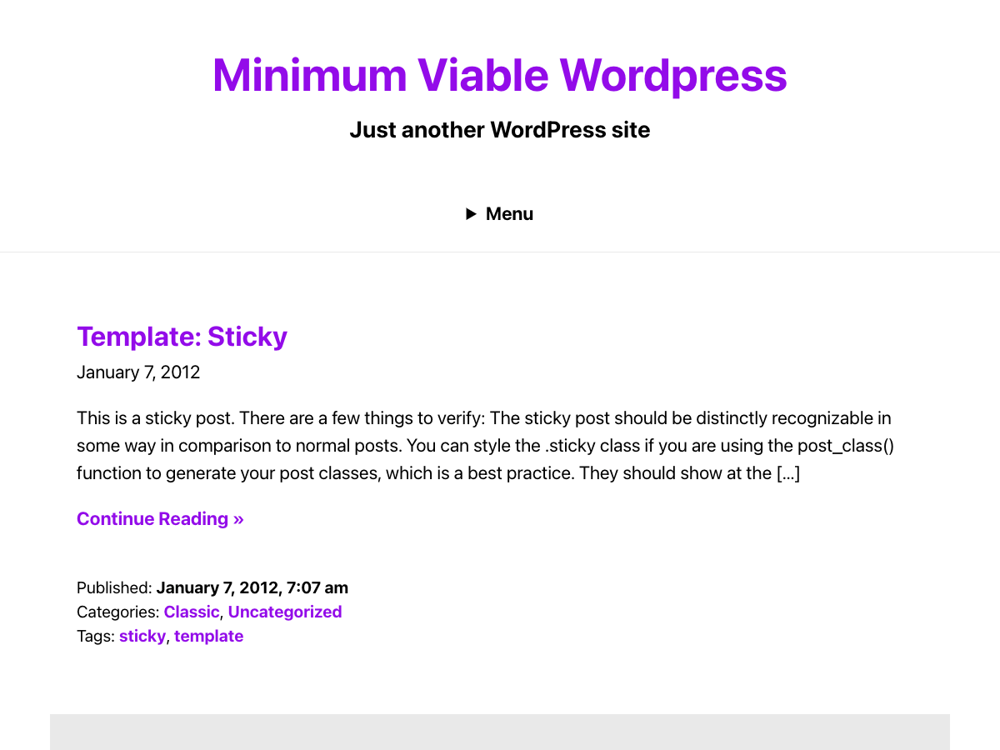

# Minimum Viable WordPress

A minimalist single-file WordPress theme. Written with semantic and accessible HTML and styled using a modified version of [MVP.css](https://andybrewer.github.io/mvp/).

This was originally designed as a fallback in case [Timber](https://www.upstatement.com/timber/) fails to load, but it also works as a minimalist theme.

[](screenshot-for-github.png)

## Supported Features

These WordPress features have been tested:

- Site name, tagline and custom logo
- Navigation menus
- Posts and pages
- Excerpts and `<!--more-->`
- Featured images (post thumbnails)
- Tags and categories

These should work but haven't been extensively tested:

- Forms and form plugins
- Block editor (Gutenberg)
- Favicons

It does not support:

- Translation / RTL languages
- 404 pages
- Search
- Authors and author pages
- Post formats
- Comments
- Sidebars and widgets
- Custom backgrounds, headers and footers
- Custom post types
- Custom taxonomies
- Custom fields

## Usage

### Within a Timber theme

Copy the index.php file to your theme and rename it `minimum-viable-wordpress.php`, then add this chunk of code to `functions.php` file:

```
if ( ! class_exists( 'Timber' ) ) {
	add_filter(
		'template_include',
		function( $template ) {
			return get_stylesheet_directory() . '/minimum-viable-wordpress.php';
		}
	);
	return;
}
```

This was tested with Timber 1.x.

### As a standalone theme

Download a copy of this repository and upload it to the WordPress backend under Appearance > Themes.

## Roadmap

- Clean up fork of [MVP.css](https://andybrewer.github.io/mvp/).
- Figure out how to detect 404 pages without using 404.php.

## Contributing

This project was designed to be extremely lean. Pull requests are welcome for minor bugfixes or enhancements. For major changes or additions, please open an issue and I'd be happy to discuss!

## License

[GPLv2](https://choosealicense.com/licenses/gpl-2.0/), as you do for WordPress.
